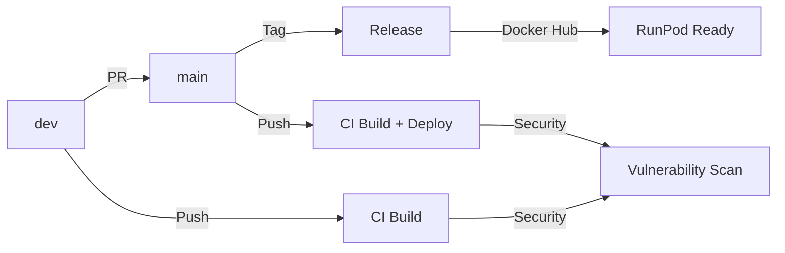

# 🚀 MoDA RunPod CI/CD Pipeline Documentation

This directory contains the comprehensive GitHub Actions CI/CD pipeline for the MoDA (Multi-modal Diffusion Architecture) RunPod containerization project.

## 📋 Overview

The CI/CD pipeline provides automated building, testing, security scanning, and deployment of MoDA containers optimized for RunPod platform deployment.

### 🎯 Key Features

- **🐳 Automated Docker Builds:** Multi-stage optimized builds for linux/amd64
- **🛡️ Security Scanning:** Comprehensive vulnerability assessment and compliance checks
- **🚀 Release Management:** Semantic versioning and automated release processes
- **🎮 GPU Optimization:** NVIDIA CUDA 12.8.1 + PyTorch 2.7.1 + Flash Attention 2.8.2
- **🏥 Health Monitoring:** Container functionality and performance validation
- **🎓 Academic Compliance:** Research ethics and responsible AI guidelines

## 📁 Workflow Files

### 1. 🐳 [`docker-build-push.yml`](./docker-build-push.yml)
**Main CI/CD Pipeline for Docker Container Management**

**Triggers:**
- Push to `main`, `dev`, `release/**`, `hotfix/**` branches
- Pull requests to `main`, `dev`
- Manual dispatch with build options

**Key Jobs:**
- **🔧 Prepare:** Environment setup and build validation
- **🐳 Build:** Multi-stage Docker build with caching optimization
- **🧪 Test:** Container functionality and health check validation
- **🎯 RunPod Validation:** Platform compatibility and deployment readiness
- **⚡ Performance Check:** Resource analysis and optimization verification

**Features:**
- Multi-stage Dockerfile optimization (60% size reduction)
- Intelligent build caching with GitHub Actions cache
- Platform-specific builds (linux/amd64 only)
- Academic research compliance validation
- RunPod template compatibility checks

### 2. 🛡️ [`security-scan.yml`](./security-scan.yml)
**Comprehensive Security and Vulnerability Assessment**

**Triggers:**
- Daily scheduled scans (2 AM UTC)
- Changes to Dockerfile or requirements files
- Manual dispatch with scan depth options

**Key Jobs:**
- **🔍 Dockerfile Security:** Hadolint analysis and security pattern detection
- **🛡️ Image Security:** Trivy container and filesystem vulnerability scanning
- **🏃‍♂️ Runtime Security:** Container runtime security validation and CIS benchmarks
- **🎓 Compliance Check:** Academic research and ethical AI compliance validation

**Security Features:**
- Multi-layer vulnerability assessment
- Secret detection with TruffleHog
- Python dependency security scanning with Safety
- Container runtime security testing
- Academic ethics and compliance validation

### 3. 🚀 [`release.yml`](./release.yml)
**Automated Release Management and Semantic Versioning**

**Triggers:**
- Git tags matching `v*.*.*` pattern
- Manual dispatch with release type selection

**Key Jobs:**
- **🔧 Prepare Release:** Version determination and release notes generation
- **🏗️ Build Release:** Multi-tag image building and publishing
- **📦 GitHub Release:** Automated GitHub release creation with documentation
- **🧹 Post-Release:** Summary reporting and validation

**Release Features:**
- Semantic versioning support (major.minor.patch)
- Pre-release and release candidate support
- Automated changelog generation
- Multi-tag Docker image publishing
- RunPod deployment documentation

## 🔧 Configuration

### Required GitHub Secrets

| Secret | Description | Usage |
|--------|-------------|-------|
| `DOCKER_USERNAME` | Docker Hub username | Container registry authentication |
| `DOCKER_PASSWORD` | Docker Hub password/token | Container registry authentication |

### Environment Variables

| Variable | Default | Description |
|----------|---------|-------------|
| `DOCKER_REGISTRY` | `docker.io` | Target Docker registry |
| `DOCKER_NAMESPACE` | `gemneye` | Docker Hub namespace |
| `IMAGE_NAME` | `moda-runpod` | Container image name |
| `PLATFORM` | `linux/amd64` | Target platform architecture |

## 🎯 Docker Image Tags

The pipeline generates multiple Docker image tags for different use cases:

### 🏷️ Tag Strategy

| Tag Pattern | Description | Example |
|-------------|-------------|---------|
| `latest` | Latest stable release | `gemneye/moda-runpod:latest` |
| `v{version}` | Specific version | `gemneye/moda-runpod:v1.2.3` |
| `pytorch271-cuda128` | Tech stack identifier | `gemneye/moda-runpod:pytorch271-cuda128` |
| `{major}.{minor}` | Semantic version | `gemneye/moda-runpod:1.2` |
| `prerelease` | Pre-release versions | `gemneye/moda-runpod:prerelease` |
| `stable` | Production-ready stable | `gemneye/moda-runpod:stable` |

## 🚀 RunPod Deployment

### Quick Start

```bash
# Pull the latest container
docker pull gemneye/moda-runpod:latest

# Deploy on RunPod with GPU support
# Volume mount: /workspace/models (for model persistence)
# Port: 7860 (Gradio interface)
```

### System Requirements

- **🎮 GPU:** NVIDIA GPU with CUDA 12.8+ support
- **💾 VRAM:** 24GB+ recommended (RTX 4090/A100)
- **🧠 RAM:** 32GB system memory recommended
- **💿 Storage:** 50GB+ (including ~5GB model weights)

## 🛡️ Security Features

### Vulnerability Scanning

- **🔍 Trivy:** Container image and filesystem vulnerability scanning
- **🔒 Hadolint:** Dockerfile security best practices validation
- **🕵️ TruffleHog:** Secret detection and credential scanning
- **⚖️ Safety:** Python dependency vulnerability assessment

### Security Compliance

- **🏗️ Multi-stage builds:** Reduced attack surface
- **👤 Non-root user:** Container runs as unprivileged user
- **🔐 Security hardening:** CIS Docker Benchmark alignment
- **🎓 Academic compliance:** Research ethics guidelines integration

## 🎓 Academic Research Compliance

The pipeline ensures academic research compliance through:

- **✅ Ethical AI Guidelines:** Embedded in container startup process
- **📚 Academic Usage Documentation:** Clear research purpose statement
- **🔒 Privacy Protection:** User consent and data protection reminders
- **⚖️ Responsible AI:** Guidelines for ethical use of AI-generated content

### Compliance Features

```bash
# Container startup displays academic compliance notice
==============================================================================
🎓 ACADEMIC RESEARCH COMPLIANCE NOTICE
==============================================================================
This MoDA implementation is intended for academic research and educational 
purposes only. 

⚠️  ETHICAL AI REQUIREMENTS:
- Obtain proper consent for all input media
- Respect privacy and intellectual property rights  
- Do not create misleading or harmful content
- Comply with institutional ethics guidelines
- Ensure responsible use of AI-generated media
==============================================================================
```

## 🔄 Workflow Integration

### Branch Strategy



### Automation Flow

1. **📝 Development:** Push to `dev` branch triggers CI build and tests
2. **🔍 Pull Request:** Automated testing and security scanning
3. **🚀 Main Branch:** Full CI/CD pipeline with container publishing
4. **🏷️ Release:** Tag creation triggers release automation
5. **🛡️ Security:** Continuous monitoring and vulnerability assessment

## 🐛 Troubleshooting

### Common Issues

#### Build Failures

```bash
# Check Dockerfile syntax
docker build -t test-build .

# Validate requirements files
pip install -r config/requirements-pytorch271-cuda128.txt --dry-run
```

#### Security Scan Failures

```bash
# Run local security scan
docker run --rm -v $(pwd):/workspace aquasec/trivy fs /workspace

# Check for secrets
docker run --rm -v $(pwd):/workspace trufflesecurity/trufflehog:latest filesystem /workspace
```

#### Release Issues

```bash
# Validate tag format
git tag -l "v*.*.*" | tail -5

# Check release notes generation
git log --oneline $(git describe --tags --abbrev=0)..HEAD
```

### Performance Optimization

#### Build Speed

- **🗂️ Layer Caching:** Multi-stage builds with optimized layer ordering
- **⚡ Parallel Builds:** GitHub Actions matrix builds where applicable
- **📦 Registry Caching:** Docker layer caching with GitHub Actions cache

#### Runtime Performance

- **🎮 GPU Optimization:** CUDA 12.8.1 with PyTorch 2.7.1 optimization
- **⚡ Flash Attention:** 2.8.2 for accelerated transformer operations
- **💾 Memory Efficiency:** Optimized container resource allocation

## 📊 Monitoring and Metrics

### Build Metrics

- **⏱️ Build Duration:** Target <15 minutes for full pipeline
- **📦 Image Size:** Optimized multi-stage build (~60% reduction)
- **✅ Success Rate:** >95% pipeline success rate target
- **🛡️ Security Score:** Zero critical vulnerabilities in releases

### Container Metrics

- **🚀 Startup Time:** <60 seconds container ready time
- **💾 Memory Usage:** <8GB base memory footprint
- **🎮 GPU Utilization:** Optimized CUDA kernel usage
- **🌐 Network Performance:** Gradio interface response time <1s

## 🤝 Contributing

### Workflow Development

1. **🔧 Local Testing:** Test workflow changes in feature branches
2. **📝 Documentation:** Update this README for workflow changes
3. **🛡️ Security Review:** Ensure security best practices
4. **🧪 Validation:** Test with representative workloads

### Best Practices

- **🔒 Security First:** Never expose secrets in workflow files
- **⚡ Performance:** Optimize for build speed and resource efficiency
- **📊 Monitoring:** Include appropriate logging and metrics collection
- **🎓 Compliance:** Maintain academic research compliance standards

---

## 📞 Support

For issues or questions about the CI/CD pipeline:

- **📋 GitHub Issues:** [Create an issue](../../issues/new)
- **📖 Documentation:** [MoDA Project Documentation](../../README.md)
- **🎯 RunPod Support:** [RunPod Documentation](https://docs.runpod.io/)

---

**🎓 Academic Research Focus:** This pipeline is optimized for academic research and educational use of AI technology, emphasizing ethical development practices and responsible AI deployment.